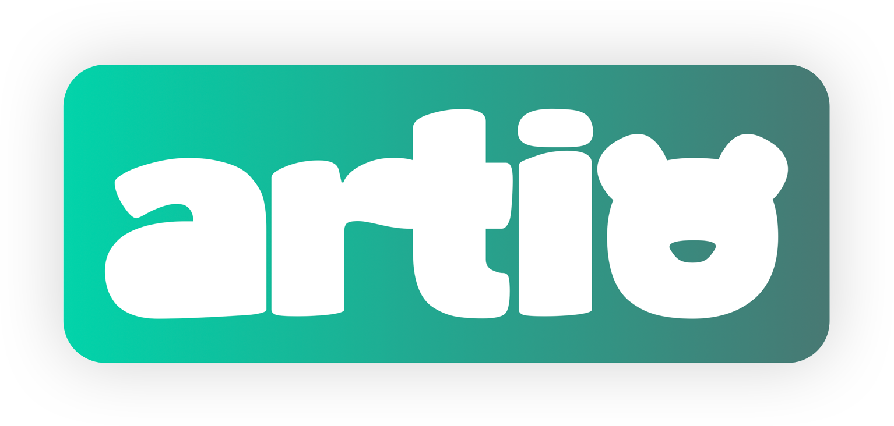

# `artio`: Component bundle for large-scale investigation of software variability in Nostr

  

 

  <strong>
    👋 <a href="#introduction">Introduction</a> &nbsp;&nbsp;| &nbsp;&nbsp; 
    📊 <a href="#dashboard">Dashboard</a> &nbsp;&nbsp;|&nbsp;&nbsp; 
    🎓 <a href="#thesis">Thesis</a> 
  </strong>

  
  
  

## Introduction

tbd

## Dashboard

## Thesis

tbd

## Components
### artio-relay

  

### artio-insight

  

### artio-miner

  

### artio-orchestration

  

